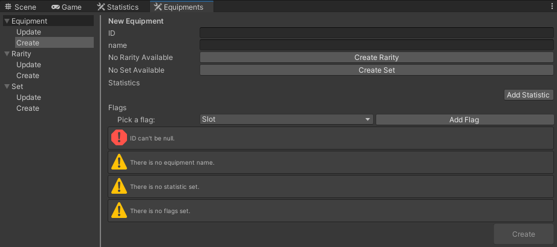

# EquipmentSmith

Rapidly create and customize RPG equipment, random generation, and ready-to-use libraries for seamless Unity integration.

## How to install

Go to your unity's root project.\
Under the folder `Packages` open the file `Manifest.json`.\
Add the package and his dependencies to the project :
```json
{
  "dependencies": {
    ...
    "com.lrtools.utility":"https://github.com/Unity-LRTools/Utility.git",
    "com.lrtools.easing":"https://github.com/Unity-LRTools/Easing.git",
    "com.lrtools.smith.statistics":"https://github.com/Unity-LRTools/Smith-Statistics.git",
    "com.lrtools.smith.equipments":"https://github.com/Unity-LRTools/Smith-Equipments.git",
  }
}
```

## Data

Create data throught the editor and access it using the `EquipmentsData` singleton.

### Editor

Empty view when creating equipment.



Filled view when creating equipment.


Update view of already created equipments. They are clickable and modifiable.


And you got the same views for rarity and set.

## Attribute

User can define his own flags to use them inside the tool. The attribute inherit from `[FlagsAttribute]`.

```csharp
using LRT.Smith.Equipments;

[EquipmentFlags]
public enum Slot
{ 
	MainHand = 1 << 1,
	OffHand = 1 << 2,
	Head = 1 << 3,
	Torso = 1 << 4,
	Pants = 1 << 5,
}

[EquipmentFlags]
public enum Type
{
	Sword = 1 << 1,
	Spear = 1 << 2,
	Hammer = 1 << 3,
}
```